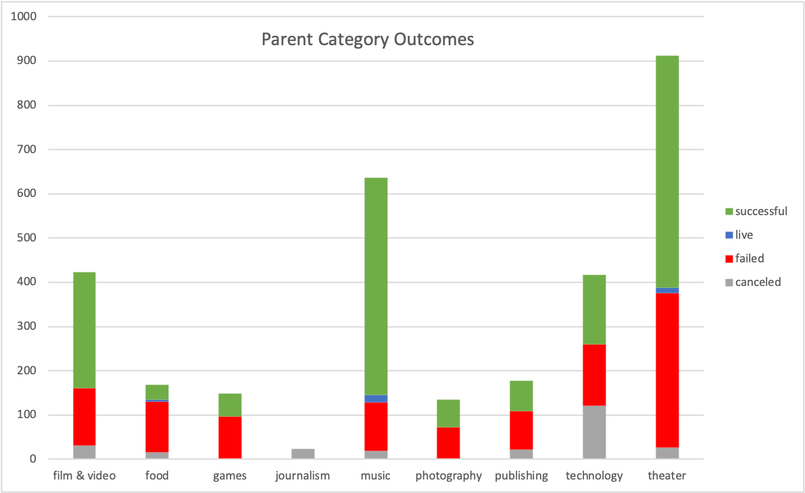

# Kickstarting with Excel

## Overview of Project

This project involves data manipulation, analysis, pivoting, and charting in Microsoft Excel. Various filters, conditional formatting, and advanced formulas were created to modify data prior to analysis. Data was then filtered and pivoted in order to drill down into relevant outputs for an analysis of Kickstarter campaigns in the *theater* category. Multiple pivot charts were created to visualize the performance of campaigns according to various attributes. 

### Purpose

The purpose of this project is to provide an up-and-coming playwright with analysis of data from the crowdfunding website [Kickstarter](https://www.kickstarter.com/) to help guide the launch of her first crowdfunding campaign. By analyzing previous campaigns in the *theater* category, one can better understand if there are specific factors that make a fundraising campaign successful. Successful, failed, and canceled campaigns were analyzed by month of launch date across multiple years and by outcome based on campaign funding goals.

## Analysis and Challenges

Analysis was conducted in Microsoft Excel on a provided Kickstarter dataset. The original dataset can be accessed [here](https://github.com/tysonseang/kickstarter-analysis/blob/main/Original%20Kickstarter%20Dataset.xlsx).

Various activities were done to modify the data into more readable formats for analysis. This includes adding column filters, freezing rows and columns, adding color-based conditional formatting of campaign outcomes, converting campaign launch and end dates from Unix time stamps, rounding data with the ROUND() function, debugging average donation errors with IFERROR() functions, and adding a launch year column with the YEAR() function.

Data was pivoted to analyze overall US Kickstarter Outcomes by Category as shown below, showcasing the popularity and success of these types of campaigns in the local region. 

Measures of central tendency and spread for successful and failed campaigns were analyzed, including the mean, median, standard deviation, upper and lower quartile, and interquartile range.

Data was also pivoted for campaign outcomes for the *theater* category by date. A line chart was then created from the pivot table to visualize the relationship between outcomes and launch month. This visualization is shown below. 

On a new worksheet, a COUNTIFS() function was used to populate columns for the number of successful, failed, and canceled Kickstarter campaigns by filtering on the Outcome column, Goal amount column, and Subcategory column using the subcategory *plays* as criteria. The Goal column is based on pre-defined dollar-amount ranges, allowing projects to be grouped based on their goal amount. Outcome percentages were then calculated based on these outputs by dividing them by the total number of successful, failed, and canceled projects within each goal group. 

### Analysis of Outcomes Based on Launch Date

As shown below, theater campaigns are most successful when launched in late Spring/early Summer. 

### Analysis of Outcomes Based on Goals

This visualization indicates that campaigns within the *plays* subcategory are most successful when launched with conservative goals under 5,000. There is a significant drop in successful campaigns when goals exceed 45,000.

### Challenges and Difficulties Encountered

I did not experience any significant challenges during the Excel analysis portion of this project. I have experience manipulating and analyzing Excel data through functions, filters, charts, and pivot tables. However, this was my first experience with GitHub, so I did encounter a few speed bumps as I delved into basic writing and formatting syntax for GitHub README files. Specific challenges in this regard included styling text, adding relative and external links, and adding images.

## Results

- What are two conclusions you can draw about the Outcomes based on Launch Date?

Historically, theater campaigns are most likely to meet their funding goals when launched between May and July. Theater campaigns are least successful when launched during the final two months of the year. The final month of the year also sees the fewest total launches of theater campaigns.

- What can you conclude about the Outcomes based on Goals?

Campaigns that launched with a goal of raising 45,000 or more were unlikely to meet their funding goals. Campaigns with the most conservative target (less than 1,000) met their goal more than 75% of the time.

- What are some limitations of this dataset?

Campaign creators are not tracked within this dataset. The success or failure of a project could be the result of the person launching and running the campaign. Location data is also limited to the country level. Additional analysis could be completed to determine the likelihood of success based on these additional datapoints. 

- What are some other possible tables and/or graphs that we could create?

Further analysis of theater campaign subcategories would help differentiate between the performance of campaigns with often widely ranging costs and goals. Theater campaigns within the *spaces* subcategory had a significantly higher average goal than those within the *plays* and *musicals* subcategories. Due to the large variance in average funding goals, I recommend continuing analysis at the subcategory level similar to what was done for the Outcomes Based on Goal analysis. Additional analysis into average donation rates and the number of contributors would also help in campaign outreach efforts. Charts analyzing average donations by month could uncover if there is any seasonality when it comes to generosity/spending. An additional chart showing the average number of backers for successful and failed campaigns across various goal groups would also provide outreach targets for campaign marketing efforts.
